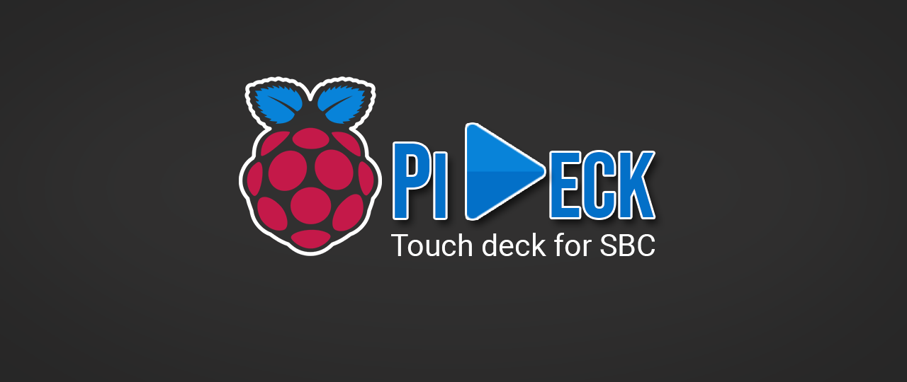

# PiDeck

    

A simple touch deck for your Raspberry Pi (and other SBCs).

## How to run

Using node, launch the server:

    node server/server.js

## Configure

To configure, either:

- edit the `server/config.json` file

or 

- launch the server `node server/server.js` and head to [http://ip_address/admin](http://ip_address/admin)

## Authors

* **Victor MEUNIER** - *ZeroFrame* - [MrEliptik](https://github.com/MrEliptik) - [victormeunier.dev@gmail.com](mailto:victormeunier.dev@gmail.com)

Want to support me? Buy me a coffee!

